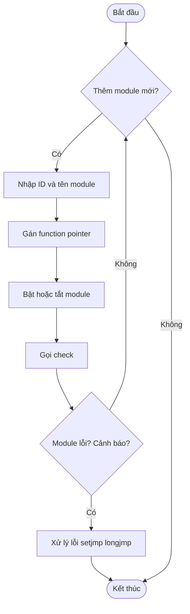

# [PROJECT DESIGN: AUTOMOTIVE MODULE MANAGER]()

## **1. Mô tả Project:**
Hệ thống **Automotive Module Manager** mô phỏng cơ chế quản lý các đơn vị điều khiển điện tử (ECU) trên ô tô thực tế. Dự án tập trung vào việc tối ưu hóa hiệu suất bộ nhớ và đảm bảo tính an toàn hệ thống thông qua các kỹ thuật lập trình C nâng cao.

**Mục tiêu chính:**
- Quản lý danh sách Module (Động cơ, Phanh ABS, Đèn, Điều hòa...) linh hoạt theo thời gian chạy.
- Kiểm soát trạng thái hệ thống chặt chẽ thông qua Bitmask.
- Phản ứng tức thì với các tình huống lỗi nguy hiểm bằng cơ chế nhảy phi cục bộ (Non-local jumps).
 
## **2. Phân tích thiết kế:**
### **2.1. Cấu trúc dữ liệu (Struct Module)**
Sử dụng `struct` kết hợp với `Function Pointer` để định nghĩa đối tượng module:
```c
typedef struct 
{
    uint8_t id;
    char name[30];
    uint8_t status;
    void (*on_status_change) (uint8_t new_status);
} Module;
```
### **2.2. Quản lý danh sách module (Dynamic Memory)**
Danh sách module được quản lý dưới dạng mảng động (`Module* list_modules`).
- **Cấp phát:** Sử dụng `malloc` và `realloc` để mở rộng danh sách khi thêm module mới, giúp tối ưu hóa RAM.
- **Giải phóng:** Sử dụng `free` để xóa module hoặc dọn dẹp bộ nhớ khi kết thúc chương trình, tránh rò rỉ bộ nhớ (Memory Leak).

### **2.3. Bitmask (Tối ưu bộ nhớ trạng thái)**
Thay vì sử dụng nhiều biến Boolean, tất cả trạng thái được nén vào 1 byte (`uint8_t`):

|Trạng thái|Bitmask|Ý nghĩa|
|----------|-------|-------|
|**STATUS_ON**|1 << 0 (001)|Module đang hoạt động|
|**STATUS_ERROR**|1 << 1  (010)|Module gặp lỗi nghiêm trọng
|**STATUS_WARNING**|1 << 2 (100)|Module có cảnh báo cần lưu ý|

**Các hàm helper:** `set_status()`, `clear_status()`, và `check_status()` giúp thao tác bit an toàn và minh bạch.

### **2.4. Function Pointer (Cơ chế gán hành động)**
Mỗi module được gán trực tiếp các hàm xử lý (`turn_on_module`, `turn_off_module`, `check_module_status`). Kỹ thuật này giúp gọi hàm một cách linh hoạt mà không cần sử dụng cấu trúc `switch-case` cồng kềnh, dễ dàng mở rộng chức năng cho từng loại module riêng biệt.

### **2.5. Xử lý lỗi (`Setjmp`/`Longjmp`)**
Cơ chế này mô phỏng hệ thống bảo vệ của ô tô:
- `setjmp`: Lưu lại trạng thái an toàn tại hàm `main`.
- `longjmp`: Khi hàm `check_module_status` phát hiện bit `STATUS_ERROR`, lệnh `handle_critical_error()` sẽ kích hoạt `longjmp` để đưa chương trình quay lại điểm an toàn ngay lập tức, bỏ qua các luồng thực thi nguy hiểm.

3. Flowchart chương trình

## **4. Hướng dẫn sử dụng:**
1. **Biên dịch:** Sử dụng lệnh make (Yêu cầu GCC và Makefile đã tạo).
2. **Chạy:** Thực thi file app.exe (Windows) hoặc ./app (Linux).
3. **Thao tác:**
   - Hệ thống tự động thêm các module mẫu.
   - Theo dõi log hiển thị trạng thái ON/OFF/WARNING.
   - Khi xuất hiện thông báo "ERROR", quan sát hệ thống tự động thực hiện cú nhảy về "Safe Mode".
4. **Dọn dẹp:** Chạy `make clean` sau khi kết thúc.


