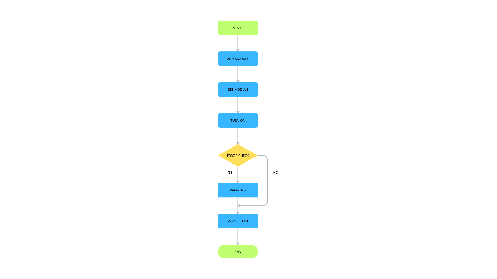

# A. Cách chạy chương trình
 Build and Run (Sử dụng Makefile)
Để biên dịch và chạy chương trình trên Windows (với MinGW), hãy mở terminal tại thư mục gốc:

Bash
```c
# Biên dịch toàn bộ project
mingw32-make all

# Chạy chương trình
main.exe

# Dọn dẹp các file object và file thực thi
mingw32-make clean
```
# B. Flowchart

